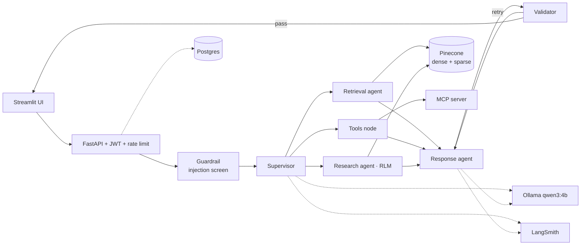

# Enterprise AI Assistant

A conversational assistant that answers questions from internal organizational documents — policies,
architecture docs, runbooks, incident reports, product specs and meeting notes — using a LangGraph
multi-agent system over hybrid dense+sparse retrieval, with role-based access control enforced
outside the model and full execution tracing.

Built for the AI Lead Technical Assessment (`ASSESSMENT.md`).

> **Status: all 8 delivery cycles built and live-verified.** See [`docs/PROGRESS.md`](docs/PROGRESS.md)
> for exactly what was verified, and [`docs/ASSUMPTIONS_AND_TRADEOFFS.md`](docs/ASSUMPTIONS_AND_TRADEOFFS.md)
> for real findings live verification surfaced along the way. Outstanding: recording the demo
> video and publishing the repository publicly (`ASSESSMENT.md`'s deliverables).

---

## What it does

- **Multi-agent orchestration** — a Supervisor routes to specialized Retrieval, Tools and Research
  agents, with a Response agent composing the answer and a Validator gating every one.
- **Recursive Language Model (RLM)** — instead of loading whole documents into context, the Research
  agent writes **Python search plans**, executes them in an AST-validated sandbox, decomposes work into
  batches, calls sub-agents recursively, and aggregates the results.
- **Hybrid retrieval** — dense and sparse Pinecone queries run concurrently and are fused with
  Reciprocal Rank Fusion, with optional reranking and full document attribution.
- **Prompt-injection defense** — every message is screened at the graph's own entry point (a
  deterministic heuristic filter, escalating to a schema-constrained classifier only when genuinely
  ambiguous) before intent classification even runs, and everything the model didn't itself write —
  retrieved documents, tool results, research findings — is framed as untrusted data it must not
  follow instructions from.
- **Transparent execution** — a real-time Agent Activity Panel shows the active graph node, tool calls,
  retrieval status, memory updates and validation results as they happen.
- **Security by construction** — RBAC is enforced at the tool-execution boundary and the retrieval
  filter, never in the prompt, so prompt injection cannot escalate privilege.
- **Fully local inference** — runs on Ollama with no LLM API key and no cost.

---

## Architecture



Every node in the graph — not just Supervisor and Response, drawn here as representative — calls
Ollama and traces to LangSmith; the full diagram in `docs/ARCHITECTURE.md` shows every edge.

Full detail, including the request lifecycle and the folder structure, in
[`docs/ARCHITECTURE.md`](docs/ARCHITECTURE.md).

---

## Stack

| Layer | Technology |
| --- | --- |
| Frontend | Streamlit (SSE streaming) |
| Backend | Python 3.11 · FastAPI · async throughout |
| Orchestration | LangGraph |
| LLM | Ollama · `qwen3:4b` (local, free) |
| Vector DB | Pinecone serverless — dense + sparse indexes |
| Embeddings | Pinecone integrated inference |
| Persistence | Postgres (Docker) |
| Observability | LangSmith |
| Tools | Knowledge search · Python analysis · MCP server |

---

## Quickstart

Full instructions — including free-tier account setup and the cost guards — in
[`docs/SETUP.md`](docs/SETUP.md).

```bash
# Prerequisites: Ollama + qwen3:4b (running natively — see below), Pinecone key, LangSmith key
cp .env.example .env          # then fill in the three API keys
ollama serve                  # if not already running as a service

docker compose up --build -d
docker compose run --rm backend python -m scripts.ingest   # first run only
```

Postgres, the backend, the MCP server, and the frontend all start together. Ollama is the one
service that stays native — reached over `http://host.docker.internal:11434` — because
containerizing it would mean setting up Windows Docker Desktop's GPU passthrough (WSL2 + the
NVIDIA Container Toolkit) on top of already-fragile GPU-residency tuning this project needed to
verify live even natively (`docs/DECISIONS.md` §3, §7). See `docs/SETUP.md` for the equivalent
native, one-terminal-per-process flow.

---

## Roles

| Role | Allowed |
| --- | --- |
| **Viewer** | Chat and search |
| **Analyst** | Search, analytics tools, MCP tools |
| **Administrator** | All tools |

Tool execution respects these permissions at the execution boundary — the agent cannot bypass them.

---

## Documentation

| Document | Read it for |
| --- | --- |
| [`docs/PROGRESS.md`](docs/PROGRESS.md) | Current state, what is done, what is next |
| [`docs/DECISIONS.md`](docs/DECISIONS.md) | Every technical decision and why it was made |
| [`docs/ARCHITECTURE.md`](docs/ARCHITECTURE.md) | System design, folder structure, request lifecycle |
| [`docs/DELIVERY_PLAN.md`](docs/DELIVERY_PLAN.md) | Build cycles, risk register, acceptance criteria |
| [`docs/SETUP.md`](docs/SETUP.md) | Prerequisites, environment variables, running locally |
| [`docs/ASSUMPTIONS_AND_TRADEOFFS.md`](docs/ASSUMPTIONS_AND_TRADEOFFS.md) | What was assumed, traded away, and why |
| [`docs/DEMO_SCRIPT.md`](docs/DEMO_SCRIPT.md) | Minute-by-minute demo video script, mapped to grading criteria |

---

## Cost

Every component runs on a free tier or locally, and no payment method is attached to any account.
Verified limits and the guards that enforce this are documented in
[`docs/DECISIONS.md`](docs/DECISIONS.md) §4.
