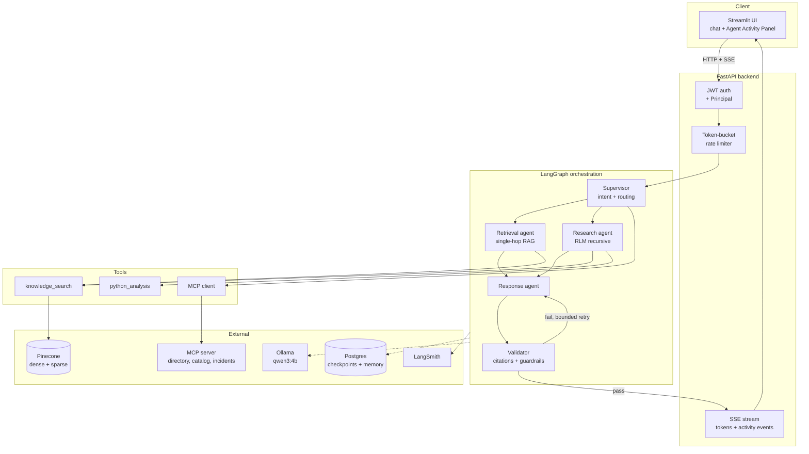

# Architecture

An enterprise AI assistant that answers questions from internal documents using a LangGraph
multi-agent system over hybrid dense+sparse retrieval, with role-based access control enforced
outside the model and full execution tracing.

Decisions and their rationale live in `docs/DECISIONS.md`. This document describes *what is built*.

---

## System overview



---

## Folder structure

```
enterprise-ai-assistant/
├── ASSESSMENT.md                    # assignment brief — READ ONLY
├── CLAUDE.md                        # session entry point
├── README.md
├── docker-compose.yml               # Postgres only
├── requirements.txt
├── pyproject.toml                   # ruff / mypy / pytest config
├── .env.example
│
├── backend/app/
│   ├── main.py                      # app factory, lifespan (Pinecone, Postgres, Ollama warm-up)
│   ├── api/
│   │   ├── deps.py                  # DI: current_principal, rate limiter, graph handle
│   │   └── v1/
│   │       ├── chat.py              # SSE chat stream
│   │       ├── auth.py              # login, token issue
│   │       ├── health.py            # liveness / readiness
│   │       └── admin.py             # admin-only operations
│   ├── core/
│   │   ├── config.py                # pydantic-settings, env-backed
│   │   ├── logging.py               # structlog JSON + correlation IDs
│   │   ├── errors.py                # exception hierarchy + FastAPI handlers
│   │   └── security/
│   │       ├── jwt.py               # issue / verify
│   │       ├── rbac.py              # role→permission matrix, Principal
│   │       └── rate_limit.py        # async per-user token bucket
│   ├── llm/
│   │   ├── provider.py              # LLMProvider protocol: astream, astructured
│   │   ├── ollama_provider.py       # schema-constrained output, timeout, retry
│   │   └── chain.py                 # fallback chain + circuit breaker
│   ├── agents/
│   │   ├── graph.py                 # graph assembly + checkpointer wiring
│   │   ├── state.py                 # typed AgentState + merge reducers
│   │   └── nodes/
│   │       ├── supervisor.py        # intent classification, task decomposition, routing
│   │       ├── retrieval.py         # single-hop RAG
│   │       ├── research.py          # multi-hop RLM entry point
│   │       ├── response.py          # final answer composition
│   │       └── validator.py         # citation + guardrail gate
│   ├── rlm/
│   │   ├── sandbox.py               # AST allowlist, stripped builtins, timeout
│   │   ├── api.py                   # search / filter / batch / sub_agent / aggregate
│   │   ├── planner.py               # schema-constrained Python plan generation
│   │   └── executor.py              # bounded recursion + fan-out
│   ├── retrieval/
│   │   ├── pinecone_store.py        # dense + sparse indexes, namespaces
│   │   ├── hybrid.py                # concurrent fan-out + RRF fusion
│   │   ├── reranker.py              # bge-reranker-v2-m3, allowlisted, budget-gated
│   │   └── ingest.py                # chunking, attribution, content-hash idempotency
│   ├── memory/
│   │   ├── session.py               # per-thread conversational memory
│   │   └── summarizer.py            # rolling summary to bound context growth
│   ├── tools/
│   │   ├── registry.py              # RBAC-aware binding + execution-boundary re-check
│   │   ├── knowledge_search.py
│   │   ├── python_analysis.py       # reuses rlm/sandbox.py
│   │   └── mcp_client.py            # async MCP client with timeouts
│   ├── guardrails/
│   │   ├── injection.py             # instruction-override / exfiltration / tool-abuse detection
│   │   ├── validators.py            # input + tool-parameter validation
│   │   ├── citations.py             # verify claims against retrieved chunk IDs
│   │   └── brand.py                 # commercial-bank persona and safety
│   └── observability/
│       ├── langsmith.py             # tracing setup, run metadata
│       └── events.py                # typed activity event bus feeding the UI
│
├── mcp_server/                      # FastMCP: employee directory, service catalog, incidents
├── frontend/                        # Streamlit chat + Agent Activity Panel
├── data/seed/                       # ~60 generated enterprise documents
├── scripts/                         # ingest, seed generation, admin utilities
├── tests/
└── docs/                            # this documentation set
```

---

## Request lifecycle

1. **HTTP request** arrives at `api/v1/chat.py` with a JWT bearer token.
2. **Auth** resolves the token into a `Principal` (user id + role) and binds it to request-scoped
   context. Everything downstream reads authorization from here, never from model output.
3. **Rate limiting** consumes a token from that user's bucket; exhaustion returns a graceful 429.
4. **Graph invocation** resumes the session thread from the Postgres checkpointer, so prior turns
   are already present.
5. **Supervisor** classifies intent with schema-constrained output and routes to Retrieval (single-hop)
   or Research (multi-hop RLM).
6. **Retrieval** issues dense and sparse queries concurrently, fuses with RRF, optionally reranks once,
   and returns attributed chunks. The `access_level` filter is derived from the principal's role.
7. **Research**, when routed, generates a Python search plan, validates it against the AST allowlist,
   executes it in the sandbox, fans out to recursive sub-agents under a bounded semaphore, and aggregates.
8. **Response** composes the answer from retrieved evidence with inline citations.
9. **Validator** verifies every citation against retrieved chunk IDs and applies brand and safety
   guardrails. Failure loops back to Response with feedback, bounded by a retry cap.
10. **Streaming** — throughout, typed activity events (node entered, tool called, retrieval status,
    memory update, validation result) are emitted over SSE alongside answer tokens, driving the
    Agent Activity Panel.
11. **Tracing** — the whole run, including agent transitions, tool calls and retrieval operations,
    is recorded to LangSmith.

---

## Design rationale by grading criterion

### Agent architecture — 20%

Four specialized agents with distinct responsibilities, coordinated by a Supervisor that routes via
**schema-constrained structured output** rather than free-text parsing. `AgentState` is typed, and
concurrent sub-agent writes merge through explicit **reducer functions** so parallel fan-out produces
deterministic state rather than last-write-wins clobbering. This addresses the bonus criterion about
multi-agent state management and failure propagation by construction rather than by convention.

### RAG design — 15%

Structure-aware chunking preserves document and section identity, which is what makes citation
verification possible downstream. Dense and sparse queries fan out **concurrently** via
`asyncio.gather`. Fusion uses **Reciprocal Rank Fusion**, chosen because it operates on ranks and
therefore needs no score normalization between two incompatible scoring regimes — a common source of
silent quality loss in hybrid systems. Namespaces partition by department; metadata filters carry
`department`, `document_type`, `access_level` and `created_date`.

### LangGraph usage — 15%

Conditional edges from the Supervisor, a bounded Validator→Response retry loop, `AsyncPostgresSaver`
checkpointing keyed by session thread, and `astream_events` as the source of the activity panel —
the UI observes the graph directly rather than being fed a parallel narration.

### RLM implementation — 10%

The planner emits **real Python** against a curated API (`search`, `filter`, `batch`, `sub_agent`,
`aggregate`). Before execution the code passes an **AST allowlist**: no imports, no dunder attribute
access, no I/O. Builtins are stripped, execution is wall-clock bounded, and recursion depth and
fan-out are hard-capped. The same sandbox backs the Python Analysis tool, so the one
security-critical component is written and audited once.

### Security and guardrails — 10%

Layered, with authorization deliberately outside the model — see `docs/DECISIONS.md` §6. Retrieved
content is framed as untrusted data. Citations are verified against retrieved chunk IDs before an
answer is released, so hallucinated attribution fails validation rather than reaching the user.

### Observability — 10%

LangSmith traces conversations, agent transitions, tool calls and retrieval operations. Structured
JSON logs carry correlation IDs that tie backend logs to trace runs.

### Async engineering — 5%

Async end to end: Pinecone HTTP, Postgres, Ollama streaming, tool execution, and recursive sub-agent
fan-out under a bounded semaphore that prevents the RLM from saturating a single local model.

---

## Failure and degradation

| Failure | Behaviour |
| --- | --- |
| Ollama timeout / model-load failure | Fallback chain, then a graceful error surfaced in the activity panel |
| Pinecone unavailable | Retrieval degrades and reports; the graph answers with an explicit evidence caveat rather than crashing |
| Rerank budget exhausted | Silently degrades to pure RRF ordering — quality reduction, never an error or a charge |
| MCP server down | Tool marked unavailable; supervisor routes around it |
| Tool timeout | Bounded, cancelled, and reported as a tool failure event |
| RLM plan fails validation | Deterministic fallback plan executes instead |
| Rate limit exceeded | Graceful 429 with retry-after |
