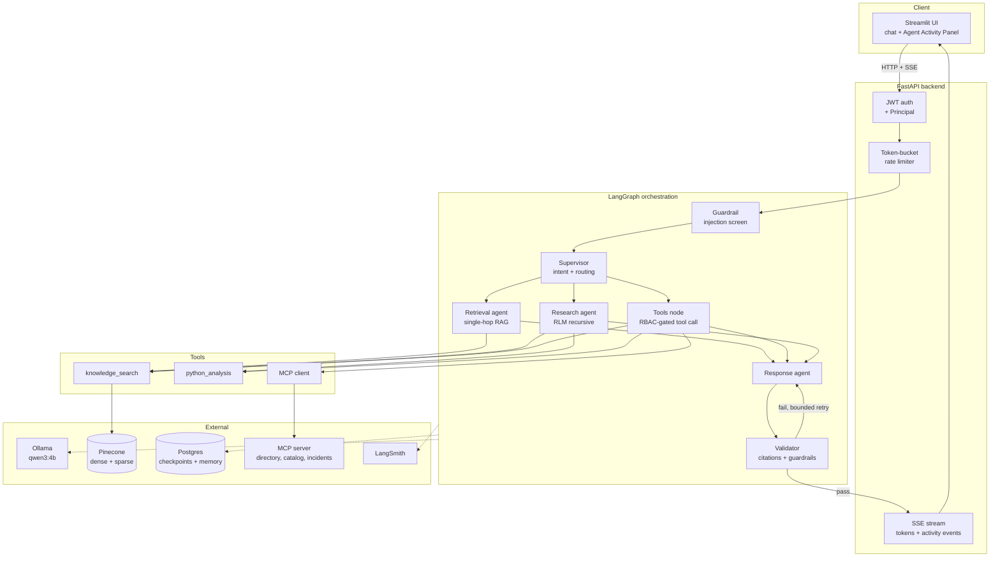

# Architecture

An enterprise AI assistant that answers questions from internal documents using a LangGraph
multi-agent system over hybrid dense+sparse retrieval, with role-based access control enforced
outside the model and full execution tracing.

Decisions and their rationale live in `docs/DECISIONS.md`. This document describes *what is built*.

---

## System overview



`TLS` (Cycle 4) is the graph's own tool-calling node — the Supervisor's `"tools"` route,
distinct from `RET`'s always-on single-hop retrieval and from `RES` (Cycle 5's RLM research
node, `"research"` route — offered only to a principal holding `Permission.ANALYTICS_TOOLS`,
per `docs/DECISIONS.md` §9). `TLS` is the one node that ever calls into `Tools`, and every
arrow leaving `Tools` toward `External` passes through `tools/registry.py`'s execution-boundary
RBAC check first — see
`docs/DECISIONS.md` §6.

`GRD` (Cycle 6) is the graph's entry point, ahead of `SUP` — every turn passes through the
prompt-injection screen before intent classification even runs. It has no conditional edge of
its own: a block raises `GuardrailViolationError` rather than routing anywhere, caught by
`api/v1/chat.py`'s existing mid-stream `AppError` handling. See `docs/DECISIONS.md` §10 and
`agents/nodes/guardrail.py`'s module docstring for why this lives inside the graph rather than
as a check before `graph.astream()` is called.

---

## Folder structure

```
enterprise-ai-assistant/
├── ASSESSMENT.md                    # assignment brief — READ ONLY
├── CLAUDE.md                        # session entry point
├── README.md
├── docker-compose.yml               # Postgres, backend, MCP server, frontend — Ollama stays native
├── .dockerignore
├── requirements.txt
├── pyproject.toml                   # ruff / mypy / pytest config
├── .env.example
│
├── backend/Dockerfile                # builds from the repo root — see its header comment
├── backend/app/
│   ├── main.py                      # app factory, lifespan (Pinecone, Postgres, Ollama warm-up)
│   ├── api/
│   │   ├── deps.py                  # DI: current_principal, rate limiter, graph handle
│   │   └── v1/
│   │       ├── chat.py              # SSE chat stream
│   │       ├── auth.py              # login, token issue
│   │       ├── health.py            # liveness / readiness
│   │       └── admin.py             # admin-only operations
│   ├── core/
│   │   ├── config.py                # pydantic-settings, env-backed
│   │   ├── logging.py               # structlog JSON + correlation IDs
│   │   ├── errors.py                # exception hierarchy + FastAPI handlers
│   │   └── security/
│   │       ├── jwt.py               # issue / verify
│   │       ├── rbac.py              # role→permission matrix, Principal
│   │       └── rate_limit.py        # async per-user token bucket
│   ├── llm/
│   │   ├── provider.py              # LLMProvider protocol: astream, astructured
│   │   ├── ollama_provider.py       # schema-constrained output, timeout, retry
│   │   └── chain.py                 # fallback chain + circuit breaker
│   ├── agents/
│   │   ├── graph.py                 # graph assembly + checkpointer wiring
│   │   ├── state.py                 # typed AgentState + merge reducers
│   │   └── nodes/
│   │       ├── guardrail.py         # prompt-injection screen, the graph's entry point (Cycle 6)
│   │       ├── supervisor.py        # intent classification, task decomposition, routing
│   │       ├── retrieval.py         # single-hop RAG
│   │       ├── tools.py             # RBAC-gated tool selection + execution (Cycle 4)
│   │       ├── research.py          # multi-hop RLM entry point
│   │       ├── response.py          # final answer composition
│   │       └── validator.py         # citation + guardrail gate
│   ├── rlm/
│   │   ├── sandbox.py               # AST allowlist, stripped builtins, timeout — built Cycle 4
│   │   ├── api.py                   # search / filter / batch / sub_agent / aggregate
│   │   ├── planner.py               # schema-constrained Python plan generation
│   │   └── executor.py              # bounded recursion + fan-out
│   ├── retrieval/
│   │   ├── pinecone_store.py        # dense + sparse indexes, namespaces
│   │   ├── hybrid.py                # concurrent fan-out + RRF fusion
│   │   ├── reranker.py              # bge-reranker-v2-m3, allowlisted, budget-gated
│   │   └── ingest.py                # chunking, attribution, content-hash idempotency
│   ├── memory/
│   │   ├── session.py               # per-thread conversational memory
│   │   └── summarizer.py            # rolling summary to bound context growth
│   ├── tools/
│   │   ├── registry.py              # RBAC-aware binding + execution-boundary re-check
│   │   ├── knowledge_search.py      # wraps retrieval/hybrid.py + reranker.py
│   │   ├── python_analysis.py       # reuses rlm/sandbox.py
│   │   ├── mcp_client.py            # async MCP client with timeouts
│   │   ├── mcp_tools.py             # RBAC-gated ToolSpecs over the MCP client
│   │   └── factory.py               # assembles the process's one ToolRegistry
│   ├── guardrails/
│   │   ├── injection.py             # instruction-override / exfiltration / tool-abuse detection
│   │   ├── validators.py            # input + tool-parameter validation
│   │   ├── citations.py             # verify claims against retrieved chunk IDs
│   │   └── brand.py                 # commercial-bank persona and safety
│   └── observability/
│       ├── langsmith.py             # explicit LangChainTracer callback + env wiring (Cycle 7)
│       └── events.py                # re-exports ActivityEvent from shared/events.py (trade-off 25)
│
├── mcp_server/                      # mcp.server.mcpserver.MCPServer: employee directory,
│   │                                 # service catalog, incidents (Streamable HTTP) — Cycle 4
│   ├── Dockerfile                   # builds from the repo root, same pattern as backend/Dockerfile
│   └── config.py                    # this process's own settings — no import of backend.app
├── frontend/                        # Streamlit chat + Agent Activity Panel — Cycle 7
│   ├── Dockerfile                   # builds from the repo root; sets PYTHONPATH=/app for Streamlit
│   ├── app.py                       # thin rendering layer: login, chat, activity panel
│   └── api_client.py                # typed HTTP/SSE client, reuses ActivityEvent from shared/
├── shared/                          # code genuinely shared across processes — nothing else
│   └── events.py                    # ActivityEvent/ActivityEventType: the one cross-process contract
├── data/seed/                       # ~60 generated enterprise documents
├── scripts/                         # ingest, seed generation, admin utilities
├── tests/
└── docs/                            # this documentation set
```

---

## Request lifecycle

1. **HTTP request** arrives at `api/v1/chat.py` with a JWT bearer token.
2. **Auth** resolves the token into a `Principal` (user id + role) and binds it to request-scoped
   context. Everything downstream reads authorization from here, never from model output.
3. **Rate limiting** consumes a token from that user's bucket; exhaustion returns a graceful 429.
3a. **Input shape validation** (`guardrails/validators.py::validate_user_message`, Cycle 6) rejects
   a well-typed but malformed message (whitespace-only, control characters, pathological
   repetition) with a plain 422 before the SSE stream even opens — distinct from prompt-injection
   screening, which runs inside the graph (step 5) so it can be traced.
4. **Graph invocation** resumes the session thread from the Postgres checkpointer, so prior turns
   are already present.
5. **Guardrail** (Cycle 6, the graph's entry point) screens the latest message with a
   deterministic heuristic filter, escalating to one schema-constrained classifier call only when
   the heuristics are genuinely inconclusive (`docs/DECISIONS.md` §10). A block raises
   `GuardrailViolationError`, surfaced to the client as one more SSE event by the same mid-stream
   `AppError` handling every other graph failure already uses.
6. **Supervisor** classifies intent with schema-constrained output and routes to Retrieval
   (single-hop), Tools (a specific RBAC-gated lookup), or Research (multi-hop RLM) — the prompt
   only ever names the tool *categories* this principal's role actually has, read from the same
   `ToolRegistry` the Tools node enforces against (`agents/nodes/supervisor.py`).
7. **Retrieval** issues dense and sparse queries concurrently, fuses with RRF, optionally reranks once,
   and returns attributed chunks. The `access_level` filter is derived from the principal's role.
7a. **Tools** (Cycle 4), when routed, chooses one tool from those this principal's role offers
   (a second, independent RBAC check happens at `tools/registry.py::execute`, not only here),
   fills in that tool's own parameter schema — screened for injection content
   (`guardrails/validators.py::validate_tool_arguments`, Cycle 6) before the handler runs — and
   executes it: `knowledge_search`, `python_analysis` (on the same sandbox Research uses), or an
   MCP-backed lookup (employee directory, service catalog, incident records). Every outcome,
   including a denial or a tool failure, becomes a plain-English `tool_output` the Response node
   relays.
8. **Research**, when routed, generates a Python search plan, validates it against the AST allowlist,
   executes it in the sandbox, fans out to recursive sub-agents under a bounded semaphore, and aggregates.
9. **Response** composes the answer from retrieved evidence (and any tool output) with inline
   citations. Every evidence section is framed as untrusted data
   (`guardrails/injection.py::frame_untrusted_content`, Cycle 6), since a retrieved document can
   itself carry text shaped like an instruction.
10. **Validator** verifies every citation against the chunks, tool result, or research finding
    actually present this turn (`guardrails/citations.py`) and applies the brand/persona
    guardrail (`guardrails/brand.py`). Failure loops back to Response with feedback, bounded by a
    retry cap.
11. **Streaming** — throughout, typed activity events (node entered, tool called, retrieval status,
    memory update, validation result) are emitted over SSE alongside answer tokens, driving the
    Agent Activity Panel.
12. **Tracing** — the whole run, including agent transitions, tool calls and retrieval operations,
    is recorded to LangSmith via an explicit tracer callback attached to the graph invocation
    (`docs/DECISIONS.md` §11), not the implicit global env-based tracer alone.

---

## Design rationale by grading criterion

### Agent architecture — 20%

Four specialized agents with distinct responsibilities, coordinated by a Supervisor that routes via
**schema-constrained structured output** rather than free-text parsing. `AgentState` is typed, and
concurrent sub-agent writes merge through explicit **reducer functions** so parallel fan-out produces
deterministic state rather than last-write-wins clobbering. This addresses the bonus criterion about
multi-agent state management and failure propagation by construction rather than by convention.

### RAG design — 15%

Structure-aware chunking preserves document and section identity, which is what makes citation
verification possible downstream. Dense and sparse queries fan out **concurrently** via
`asyncio.gather`. Fusion uses **Reciprocal Rank Fusion**, chosen because it operates on ranks and
therefore needs no score normalization between two incompatible scoring regimes — a common source of
silent quality loss in hybrid systems. Namespaces partition by department; metadata filters carry
`department`, `document_type`, `access_level` and `created_date`.

### LangGraph usage — 15%

Conditional edges from the Supervisor, a bounded Validator→Response retry loop, `AsyncPostgresSaver`
checkpointing keyed by session thread, and `astream_events` as the source of the activity panel —
the UI observes the graph directly rather than being fed a parallel narration.

### RLM implementation — 10%

The planner emits **real Python** against a curated API (`search`, `filter`, `batch`, `sub_agent`,
`sub_agents`, `aggregate`). Before execution the code passes an **AST allowlist**: no imports, no
dunder attribute access, no I/O. Builtins are stripped, execution is wall-clock bounded, and
recursion depth and fan-out are hard-capped by a shared `RLMBudget` (`rlm/api.py`) — capable of
2+ levels of recursive plan generation and multi-way concurrent fan-out, though both default to
1 on this hardware for a reason verified live, not assumed (`docs/DECISIONS.md` §9). The same
sandbox backs the Python Analysis tool, so the one security-critical component is written and
audited once. A generated plan that fails validation twice, or fails at runtime, falls back to a
fixed, hand-written deterministic plan rather than failing the turn.

### Security and guardrails — 10%

Layered, with authorization deliberately outside the model — see `docs/DECISIONS.md` §6.
Prompt injection is screened at the graph's entry point (`agents/nodes/guardrail.py`): a
deterministic heuristic filter for the three attack shapes ASSESSMENT.md names (instruction
override, data exfiltration, tool abuse), escalating to a schema-constrained classifier call
only when the heuristics are inconclusive (`docs/DECISIONS.md` §10). Retrieved content, tool
results and research findings are all framed as untrusted data
(`guardrails/injection.py::frame_untrusted_content`) — a compromised document is a second
injection channel a chat-endpoint screen cannot see at all. Citations are verified against the
chunks, tool result, and research finding actually present that turn
(`guardrails/citations.py`) before an answer is released, so hallucinated attribution fails
validation rather than reaching the user. A brand/persona guardrail (`guardrails/brand.py`)
catches a draft that breaks the bank-assistant persona or echoes the system prompt back
verbatim. Input and tool-parameter validation (`guardrails/validators.py`) reject malformed
chat messages and tool arguments that carry an injection payload, independent of shape
validation the request/tool schemas already perform.

### RBAC — 5%

Enforced twice, independently, per tool call (`tools/registry.py`): **bind time**
(`available_to`) narrows which tools the Supervisor's and Tools node's LLM calls are even shown,
and the **execution boundary** (`execute`) re-checks the same principal against the same
permission regardless of how the call arrived — a viewer handed straight to `execute(...)` with
no LLM or graph involved is denied exactly the same way a viewer routed there through the graph
is (`tests/tools/test_registry.py`). The retrieval `access_level` filter
(`retrieval/models.py::allowed_access_levels`) is the same two-tier idea applied to documents
instead of tools: derived from the principal's role, never from anything the model emits.

### Observability — 10%

LangSmith traces conversations, agent transitions, tool calls and retrieval operations, via an
explicit `LangChainTracer` attached as `config["callbacks"]` on every graph invocation
(`observability/langsmith.py::build_tracing_callbacks`, `docs/DECISIONS.md` §11) — live
verification found that env-var-only global tracing does not reach a call made from inside a
LangGraph node, so tracing is wired explicitly rather than left to that implicit mechanism.
Every chat turn becomes one `chat_turn` root run, tagged with the caller's role and carrying the
thread id and correlation id in its metadata, with the Guardrail, Supervisor, Retrieval/Tools/
Research and Response/Validator calls nested underneath it as child runs — a reader can go from
a backend log line's correlation id straight to the matching trace. Structured JSON logs carry
those same correlation IDs.

### Async engineering — 5%

Async end to end: Pinecone HTTP, Postgres, Ollama streaming, tool execution (including the MCP
client's Streamable HTTP session), and recursive sub-agent fan-out under a bounded semaphore that
prevents the RLM from saturating a single local model. The Python Analysis sandbox is the one
necessary exception — `exec()` is inherently synchronous — and is run on a worker thread via
`asyncio.wait_for(loop.run_in_executor(...))` rather than blocking the event loop directly.

---

## Failure and degradation

| Failure | Behaviour |
| --- | --- |
| Ollama timeout / model-load failure | Fallback chain, then a graceful error surfaced in the activity panel |
| Pinecone unavailable | Retrieval degrades and reports; the graph answers with an explicit evidence caveat rather than crashing |
| Rerank budget exhausted | Silently degrades to pure RRF ordering — quality reduction, never an error or a charge |
| MCP server down | Tool marked unavailable; supervisor routes around it |
| Tool timeout | Bounded, cancelled, and reported as a tool failure event |
| RLM plan fails validation | Deterministic fallback plan executes instead |
| RLM sandbox exceeds its wall-clock budget, or every fallback attempt still fails | Research node catches the typed error and folds a plain-English explanation into `research_output`; the turn still completes rather than failing outright |
| Rate limit exceeded | Graceful 429 with retry-after |
| Prompt-injection heuristic match | Turn blocked at the graph's entry point (`agents/nodes/guardrail.py`), surfaced as an SSE error event and a LangSmith-traced run rather than a silent drop |
| Injection classifier call fails (LLM unavailable) on an ambiguous message | Fails open — the heuristic filter already ruled out every confident attack pattern, so this degrades like any other non-authorization dependency rather than blocking the user on an infrastructure hiccup (`docs/DECISIONS.md` §10) |
| Validator finds a hallucinated citation or a brand/persona violation | Same bounded Validator -> Response retry loop as a structural failure, with the specific violation fed back as revision feedback |
